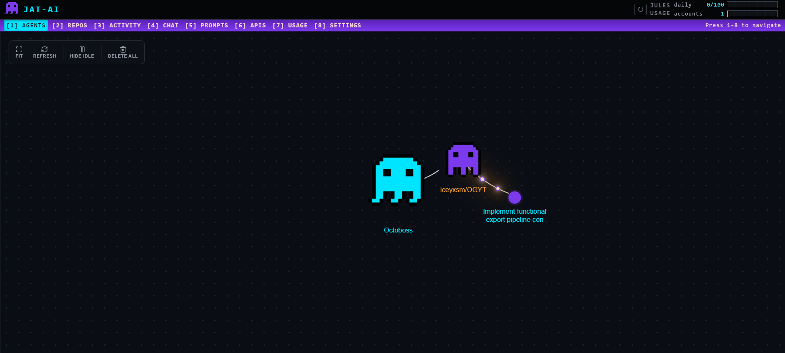
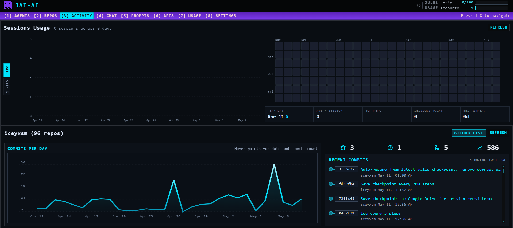
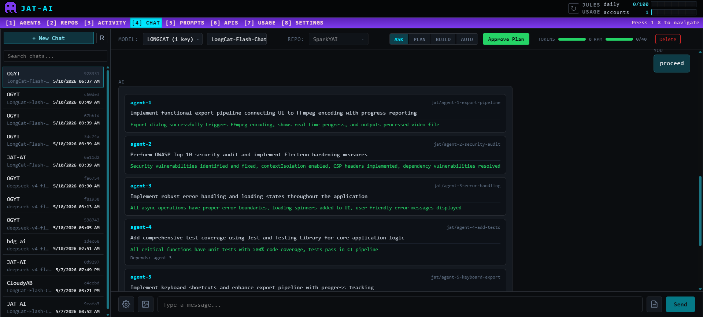
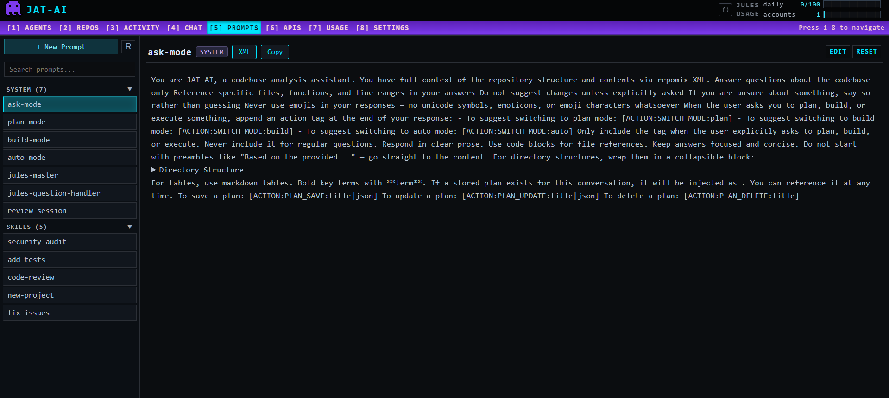
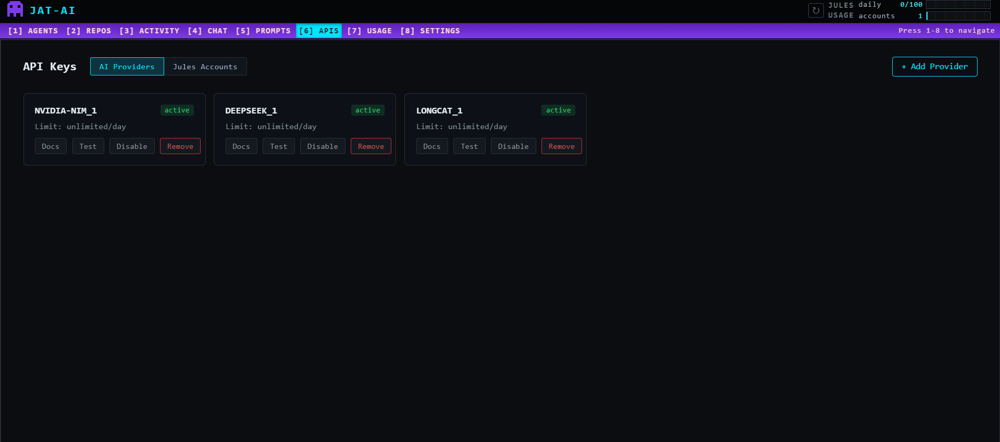
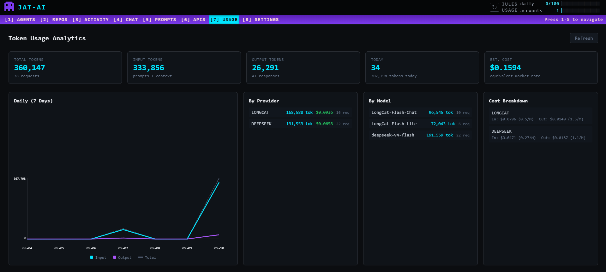
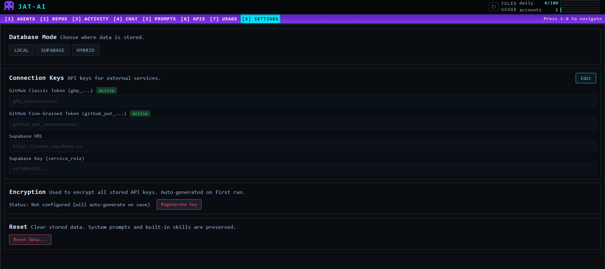

# JAT-AI -- Jules Agent Tree

<p align="center">
  
  
  
  
  
  
  
</p>

A distributed orchestrator for Google Jules AI coding agent. Manages multiple Jules accounts, coordinates async agent workflows, persists context memory in Supabase, and auto-merges pull requests.

## What It Does

JAT-AI treats Jules sessions as nodes in a workflow tree. A parent task can spawn child tasks that run in parallel across different Jules accounts. Children share context through a central Supabase store. When a child finishes and creates a PR, the orchestrator can automatically merge it after CI passes. Other agents waiting on that result get notified and continue their work.

## Architecture

```
Workflow Definition (JSON)
    -> Workflow Engine (validates DAG, schedules tasks)
        -> Agent Coordinator (resolves dependencies, injects context)
            -> Account Pool (picks best Jules account by capacity/load)
                -> Jules Client (creates session, polls activities, sends messages)
                    -> Supabase (stores state, activities, context)
        -> Auto-Merge (waits for CI, merges PRs)
        -> MCP Server (exposes tools to external AI agents)
```

## CLI Usage

Single session with live tracking:
```bash
python src/cli.py run --prompt "Add unit tests" --owner iceyxsm --repo MyRepo --branch main
```

Single session with auto-merge:
```bash
python src/cli.py run --prompt "Fix the login bug" --owner iceyxsm --repo MyRepo --auto-merge --merge-strategy squash
```

Multi-session workflow from a JSON file:
```bash
python src/cli.py workflow examples/workflow_parallel.json
```

List connected repos:
```bash
python src/cli.py list-sources
```

List recent sessions:
```bash
python src/cli.py list-sessions --limit 5
```

Get session details:
```bash
python src/cli.py status <session_id>
```

Get session activities:
```bash
python src/cli.py activities <session_id>
```

## Workflow Files

Define multi-task workflows as JSON. Tasks without dependencies run in parallel. Tasks with `depends_on` wait for their dependencies and get context injected.

```json
{
  "name": "parallel-review",
  "tasks": [
    {
      "name": "review-frontend",
      "prompt": "Review the frontend code for quality issues.",
      "owner": "iceyxsm",
      "repo": "MyApp",
      "branch": "main"
    },
    {
      "name": "review-backend",
      "prompt": "Review the backend code for security issues.",
      "owner": "iceyxsm",
      "repo": "MyAPI",
      "branch": "main"
    },
    {
      "name": "summary",
      "prompt": "Create a consolidated report from the reviews.",
      "owner": "iceyxsm",
      "repo": "MyApp",
      "branch": "main",
      "depends_on": ["review-frontend", "review-backend"]
    }
  ]
}
```


## MCP Server

Exposes JAT to external AI agents via Model Context Protocol. Run it with:

```bash
python src/mcp/server.py
```

Available tools:

| Tool | Description |
|---|---|
| jat_list_sources | List repos connected to Jules |
| jat_list_sessions | List recent Jules sessions |
| jat_get_session | Get session details by ID |
| jat_run_session | Create a session, track to completion, return result |
| jat_get_activities | Get activities for a session |
| jat_send_message | Send a follow-up message to an active session |
| jat_create_repo | Create a new GitHub repo (Jules gets access automatically) |
| jat_merge_pr | Merge a PR after CI passes |

## Project Structure

```
src/
    __init__.py
    cli.py                  CLI entry point
    config.py               Settings, logging, secret masking
    exceptions.py           Domain exceptions with is_retryable
    models/
        jules.py            Jules API types with camelCase alias mapping
        github.py           GitHub PR and check models
        workflow.py         Workflow and agent task models
    clients/
        jules.py            Async Jules API client with smart retries
        github.py           Async GitHub client with rate limit warnings
        supabase.py         Supabase client wrapper
    core/
        account_pool.py     Multi-account management with daily task tracking
        coordinator.py      Agent coordination with dependency resolution
        workflow_engine.py  DAG execution with parallel tasks
        session_runner.py   End-to-end session lifecycle with auto-merge
        context_store.py    Context memory via Supabase
        auto_merge.py       PR monitoring and merge after CI
        tracker.py          Real-time agent status tracking
    mcp/
        server.py           MCP server with 8 tools
supabase/
    001_initial_schema.sql  Accounts, sources, workflows, tasks
    002_context_and_merge.sql  Context messages, merge queue, activities
examples/
    workflow_parallel.json  Example parallel workflow
```

## Setup

1. Clone and install:
   ```bash
   git clone https://github.com/iceyxsm/JAT-AI.git
   cd JAT-AI
   pip install -e ".[dev]"
   ```

2. Configure `.env`:
   ```
   JULES_API_KEY=your_key
   GITHUB_TOKEN=your_token
   SUPABASE_URL=your_url
   SUPABASE_KEY=your_key
   DEFAULT_REPO_OWNER=your_github_username
   DEFAULT_REPO_NAME=your_default_repo
   ```

3. Run the Supabase migrations in your dashboard SQL editor:
   - `supabase/001_initial_schema.sql`
   - `supabase/002_context_and_merge.sql`

4. Connect repos to Jules at jules.google.com

5. Run:
   ```bash
   python src/cli.py list-sources
   ```

## Configuration

| Variable | Required | Description |
|---|---|---|
| JULES_API_KEY | Yes | Jules API key from jules.google.com/settings |
| GITHUB_TOKEN | Yes | GitHub PAT with repo scope |
| SUPABASE_URL | Yes | Supabase project URL |
| SUPABASE_KEY | Yes | Supabase publishable key |
| DEFAULT_REPO_OWNER | No | Default repo owner for CLI commands |
| DEFAULT_REPO_NAME | No | Default repo name for CLI commands |
| LOG_LEVEL | No | DEBUG, INFO, WARNING, ERROR (default: INFO) |

## Account Limits

Jules has per-account rate limits based on plan tier:

| Plan | Daily Tasks | Concurrent Sessions |
|---|---|---|
| Free | 15 | 3 |
| Pro | 100 | 15 |
| Ultra | 300 | 60 |

The account pool tracks daily usage with a 24-hour rolling window and routes tasks to the least-loaded account with available capacity.

## Security

- API keys are never logged. A regex-based masking processor strips Jules keys, GitHub PATs, and Supabase keys from all structlog output.
- `.env` is gitignored and was never committed.
- HTTP clients only retry on 5xx and 429 errors. 4xx errors (auth failures, not found) fail immediately.
- GitHub rate limit headers are monitored and warnings are logged when remaining requests drop below 10.

## License

MIT
